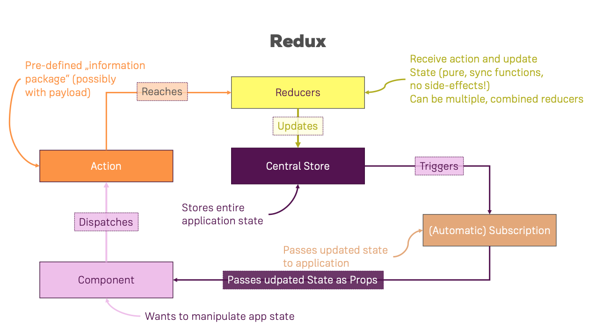

## Redux

When you say `Redux` you say `state management`.

## Basic concepts
Redux works standalone and there are some concepts to understand to use it properly:
* `store`
* `reducers`
* `actions` (type and payload)